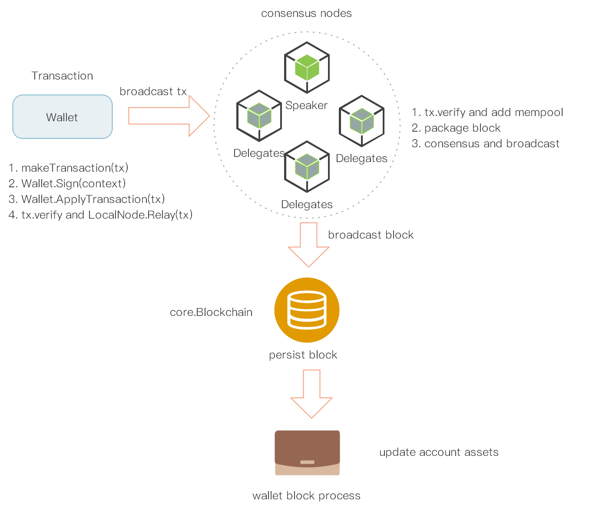

# 交易

<!-- TOC -->

- [交易](#交易)
    - [NEO3变更部分](#neo3变更部分)
    - [交易结构](#交易结构)
        - [version](#version)
        - [sender](#sender)
        - [systemFee](#systemfee)
        - [networkFee](#networkfee)
        - [attributes](#attributes)
            - [属性使用类型](#属性使用类型)
        - [script](#script)
        - [witnesses](#witnesses)
            - [调用脚本](#调用脚本)
            - [验证脚本](#验证脚本)
    - [交易序列化](#交易序列化)
    - [交易签名](#交易签名)

<!-- /TOC -->

Neo中的交易是带签名的数据包，是操作Neo网络的唯一方式。Neo区块链账本中的每个区块都包含有一个或多个交易，使得每个区块可以对交易进行批处理。一笔交易由客户端发起，经由钱包封装属性并签名后发往钱包所属的节点。网络中的任意节点都可以对接收到的交易进行验证，并转发至共识节点。共识节点会选择性的将交易打包到提案块中并广播进行共识。共识通过后广播至网络中的节点，各节点会对区块中的每笔交易进行验证并更新各自的账本。

## NEO3变更部分

- 删除
    - 交易类型：弃用NEO2中使用的9种交易类型，统一使用transaction类型，并重新定义其[交易结构](#交易结构)。
    - [资产](../合约#原生合约)：NEO和GAS代币弃用UTXO模型，使用原生合约实现的账户模型。

- 更新
    - [系统手续费](#systemfee)：取消了每笔交易10 GAS的免费额度，并重新定义每种虚拟机指令集所对应的执行[费用](../虚拟机#费用)。
    - [网络手续费](#networkfee)：重新定义网络手续费的计算公式。

## 交易结构 ***(NEO3 变更)***

在Neo网络中，所有的交易都使用同一种类型，其数据结构如下所示：

| 字段        | 类型    | 说明                              |
|--------------|---------|------------------------------------------|
| `version`    | byte   | 交易版本号，目前为0                    |
| `nonce`    | uint   | 随机数                   |
| `validUntilBlock`    | uint   |  交易的有效期                |
| `sender`    | UInt160   | 发送方的地址脚本哈希                    |
| `systemFee`    | long   | 支付给网络的资源费用     |
| `networkFee`    | long   | 支付给验证人打包交易的费用    |
| `attributes` | tx_attr[]   | 交易所具备的额外特性  |
| `script`     | byte[]   | 交易的合约脚本 |
| `witnesses`  | Witness[]   | 用于验证交易的脚本列表    |

### version
version属性允许对交易结构进行更新，使其具有向后兼容性。 目前版本为0。
### sender
由于NEO3弃用了UTXO模型，仅保留有账户余额模型。原生资产NEO和GAS的转账交易统一为NEP-5资产操作方式，因此交易结构中不再记录inputs和outputs字段，通过sender字段来跟踪交易的发送方。该字段是钱包中交易发起账户的脚本哈希值。
### systemFee
系统费用是根据NeoVM要执行的指令计算得出的费用，每一个指令所对应的费用，请参考[opcode 费用](../虚拟机#费用)。NEO3取消了每笔交易10 GAS的免费额度，系统费用总额受合约脚本的指令数量和指令类型影响。计算公式如下所示：

其中，*OpcodeSet* 为指令集，𝑂𝑝𝑐𝑜𝑑𝑒𝑃𝑟𝑖𝑐𝑒𝑖为第 *i* 种指令的费用，𝑛𝑖为第 *i* 种指令在合约脚本中的个数。
### networkFee
网络费是用户向Neo网络提交交易时支付的费用，作为共识节点的出块奖励。每笔交易的网络费存在一个基础值，用户支付的网络费需要大于或等于此基础值，否则交易无法通过验证。基础网络费计算公式如下所示：

其中，*VerificationCost*为虚拟机验证交易签名消耗的指令费用，*tx.Length*为交易数据的字节长度，*FeePerByte*为交易每字节的费用，目前为0.00001GAS。

### attributes
根据具体的交易类型允许向交易添加额外的属性。 对于每个属性，必须指定使用类型，以及外部数据和外部数据的大小。

| 字段| 类型| 说明|
|----------|-------|------------------------|
| `usage`  | uint8 | 属性使用类型                  |
| `data`   | byte[] |   交易待校验脚本，当usage=0x20时，data的值类型必须是 UIint160   |

#### *usage*
以下使用类型可以包括在交易的attributes中。

| 值    | 名称| 说明| 类型|
|---------------|-------------|---------------|--------------|
| `0x20`           | `Cosigner`    |  签名验证          | `byte`   |
| `0x81`           | `Url`          | 外部介绍信息地址    | `byte`  |

​每个交易最多可以添加16个属性。

### script
  虚拟机所执行的合约脚本。
### witnesses
witnesses属性用于验证交易的有效性和完整性。Witness即“见证人”， 包含两个属性。

| 字段 | 说明|
|--------------|------------------|
| `InvocationScript`   | 调用脚本，向验证脚本传递参数      |
| `VerificationScript` |验证脚本   |

可以为每个交易添加多个见证人，也可以使用具有多方签名的见证人。

#### *调用脚本*

调用脚本可以通过以下步骤进行构造：

1.	`0x40`（PUSHBYTES64）后跟64字节长的签名

通过重复这些步骤，调用脚本可以为多方签名合约推送多个签名。

#### *验证脚本*

验证脚本，常见为地址脚本，包括普通地址脚本，和多签地址脚本。也包括自定义的鉴权合约脚本。

## 交易序列化

除IP地址和端口号外，Neo中所有变长的整数类型都使用小端序存储。交易序列化时将按以下字段顺序执行序列化操作：

| 字段| 说明|
|----------|------------|
| `version`  | - |
| `nonce`   | - |
| `sender`   | - |
| `systemFee`   | - |
| `networkFee`   | -|
| `validUntilBlock`   | - |
| `attributes`   |需先序列化数组长度`WriteVarInt(length)`，之后再分别序列化数组各个元素 |
| `script`   | 需先序列化数组长度`WriteVarInt(length)`，之后再分别序列化数组各个元素 |
| `witnesses`   | 需先序列化数组长度`WriteVarInt(length)`，之后再分别序列化数组各个元素 |

> 注意，WriteVarInt（value) 是根据value的值，存储非定长类型, 根据取值范围决定存储大小。

| Value 值范围 | 存储类型 |
|--------------------|--------------|
| value < 0xFD | byte(value) |
| value <= 0xFFFF | 0xFD + ushort(value) |
| value <= 0xFFFFFFFF | 0xFE + uint(value) |
| value > 0xFFFFFFFF | 0xFF + value |

## 交易签名
交易签名是对交易本身的数据（不包含签名数据，即witness部分）进行ECDSA方法签名。

*点击[此处](../../en/Transactions)查看交易英文版*

