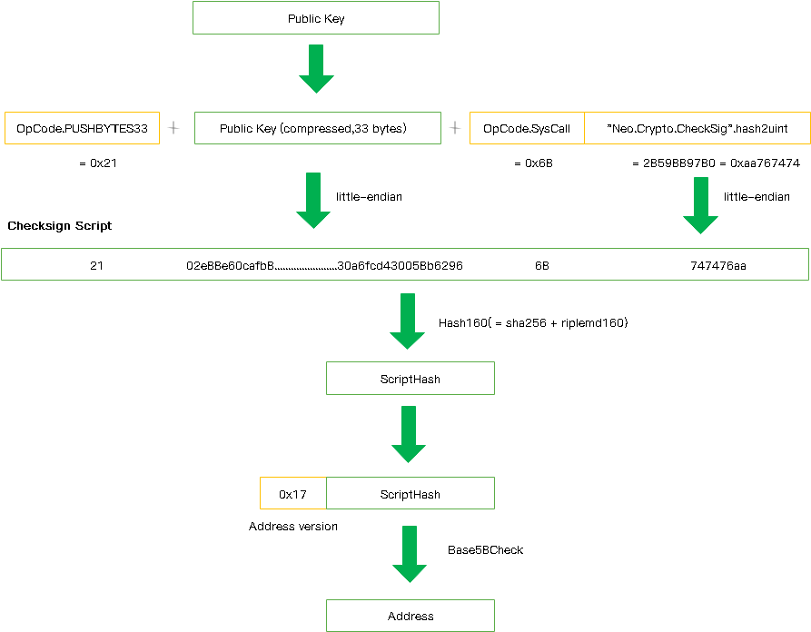
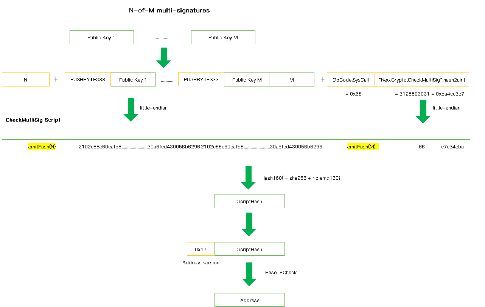

<center> <h2> Wallets </h2> </center>

<!-- TOC -->

- [账户](#账户)
    - [私钥](#私钥)
    - [公钥](#公钥)
    - [地址](#地址)
- [钱包文件](#钱包文件)
    - [DB3文件](#db3文件)
    - [NEP6 文件](#nep6-文件)
        - [加密方法](#加密方法)
        - [解密方法](#解密方法)
- [签名](#签名)

<!-- /TOC -->

<hr/>

&emsp;&emsp;钱包是NEO的基础组件，是用户接入NEO网络的载体，负责完成与之相关一系列的工作和任务。NEO的钱包可以自行设计和修改，但需要满足一定的规则。

### 账户

​	Neo中，账户即合约，地址代表的为一段合约代码，从私钥到公钥，再到地址的流程如下图。


#### 私钥

&emsp;&emsp; 私钥是一个随机生成的位于1和n之间的任何数字（n是⼀个常数，略小于2的256次方），一般用一个256bit(32字节)数表示。

&emsp;&emsp; 在NEO中私钥主要采用两种编码格式：

1. hex string 格式：

   hexstring格式是将byte[]数据使用16进制字符表示的字符串。

2. WIF 格式：

   wif格式是在原有32字节数据前后添加前缀0x80和后缀0x01,并做Base58Check编码的字符串


Example:

| 格式 |   值  |
|------|------|
|  byte[]  |  [0xc7,0x13,0x4d,0x6f,0xd8,0xe7,0x3d,0x81,0x9e,0x82,0x75,0x5c,0x64,0xc9,0x37,0x88,0xd8,0xdb,0x09,0x61,0x92,0x9e,0x02,0x5a,0x53,0x36,0x3c,0x4c,0xc0,0x2a,0x69,0x62] |
| hex string | c7134d6fd8e73d819e82755c64c93788d8db0961929e025a53363c4cc02a6962 |
| WIF | L3tgppXLgdaeqSGSFw1Go3skBiy8vQAM7YMXvTHsKQtE16PBncSU |


#### 公钥

&emsp;&emsp;公钥是通过ECC算法将私钥运算得到的一个点（x,y）。该点的x、y坐标都可以用32字节数据表示。neo与比特币稍有不同，neo选取了secp256r1曲线作为其ECC算法的参数。在neo中公钥有两种编码格式：

* **非压缩型公钥**
	0x04+x坐标（32字节）+y坐标（32字节）

* **压缩性公钥**
	0x02/0x03+x坐标（32字节）

Example:

| 格式 | 值 |
|-------|-----|
| 私钥 | c7134d6fd8e73d819e82755c64c93788d8db0961929e025a53363c4cc02a6962 |
| 公钥（压缩性） | 035a928f201639204e06b4368b1a93365462a8ebbff0b8818151b74faab3a2b61a |
| 公钥（非压缩型）| 045a928f201639204e06b4368b1a93365462a8ebbff0b8818151b74faab3a2b61a35dfabcb79ac492a2a88588d2f2e73f045cd8af58059282e09d693dc340e113f |

#### 地址

* 普通地址
  1. 通过公钥，构建一个 CheckSig 地址脚本，脚本格式,  如下图

  ```bash
  0x21 + 公钥(压缩型 33字节) + 0x68 + 0x747476aa
  ```


  2. 计算地址脚本合约哈希(20字节，地址脚本合约做一次sha256和riplemd160得到)
  3. 在地址脚本合约哈希前添加版本号（ 目前neo所使用的协议版本是23所以对应字节为0x17）
  4. 对字节数据做Base58Check编码


Example

| 名称 | 值 |
|-----|----|
| 私钥  | 3bf2c2c3a43ee817c5a7704b60e5265e73e585eb85b17091c451ddf72fd80c41 |
| 公钥（压缩型） | 02208aea0068c429a03316e37be0e3e8e21e6cda5442df4c5914a19b3a9b6de375 |
| 地址脚本  | 2102208aea0068c429a03316e37be0e3e8e21e6cda5442df4c5914a19b3a9b6de37568747476aa |
| 地址 |  Aa63RMYRWHPRcrZNzUnq5SNrPqoV866Spu |


* 多方签名地址

	1. 通过多个地址，构建一个 N-of-M CheckMultiSig 多方签名的地址脚本，脚本格式如下：

```bash
emitPush(N) + 0x21 + 公钥1(压缩型 33字节)  + .... + 0x21 + 公钥m(压缩型 33字节)  + emitPush(M) +  0x68 + 0xc7c34cba
```



  2. 计算地址脚本合约哈希(20字节，地址脚本合约做一次sha256和riplemd160得到)
  3. 在地址脚本合约哈希前添加版本号（ 目前neo所使用的协议版本是23所以对应字节为0x17）
  4. 对字节数据做Base58Check编码


Example

| 名称 | 值 |
|-----|----|
| 私钥  | 97374afac1e801407d6a60006e00d555297c5019788795f017d4cd1fff3df529， aab9d4e4223e088aa6eb1f0ce75c11d149625f6d6a19452d765f8737200a4c35 |
| 公钥（压缩型） | 035fdb1d1f06759547020891ae97c729327853aeb1256b6fe0473bc2e9fa42ff50，03eda286d19f7ee0b472afd1163d803d620a961e1581a8f2704b52c0285f6e022d |
| 地址脚本  | 5221035fdb1d1f06759547020891ae97c729327853aeb1256b6fe0473bc2e9fa42ff502103eda286d19f7ee0b472afd1163d803d620a961e1581a8f2704b52c0285f6e022d5268c7c34cba |
| 地址 | AQuqfBZmzejZt4CQc7mkgvEXmSvdMUEBok |


> emitPush(number) 注意其取值范围， number的类型为 BigInteger时
>
> | Number值  | 放入指令 | 值 |
> |-----|----------|-----|
> | -1 | OpCode.PUSHM1 | 0x4F |
> | 0  | OpCode.PUSH0  | 0x00  |
> | 0 < number <= 16 | OpCode.PUSH1 - 1 + (byte)number  | 0x51 -1 + number |
> | number > 16 | number.bytes.length + number.bytes | |


> 注意：NEO3中的地址脚本发生了变动，不再使用 Opcode.CheckSig, OpCode.CheckMultiSig 指令， 换成使用互操作服务调用，即`SysCall "Neo.Crypto.CheckSig".hash2uint`, `SysCall "Neo.Crypto.CheckMultiSig".hash2unit` 方式。


### 钱包文件

#### DB3文件

&emsp;&emsp;db3钱包文件是neo采用sqlite技术存储数据所使用存储文件，文件尾缀名：`.db3`。 存储时，分别包含如下四张表：

1. **账户表 Account**

| 字段                | 类型          | 是否必须 | 备注       |
| ------------------- | ------------- | -------- | ---------- |
| PrivateKeyEncrypted | VarBinary(96) | 是       | AES256加密 |
| PublicKeyHash       | Binary(20)    | 是       | 主键       |

2. **地址表 Address**

| 字段       | 类型       | 是否必填 | 备注 |
| ---------- | ---------- | -------- | ---- |
| ScriptHash | Binary(20) | 是       | 主键 |

3. **合约表 Contract**

| 字段          | 类型       | 是否必填 | 备注                      |
| ------------- | ---------- | -------- | ------------------------- |
| RawData       | VarBinary  | 是       |                           |
| ScriptHash    | Binary(20) | 是       | 主键，外键，关联Address表 |
| PublicKeyHash | Binary(20) | 是       | 索引，外键，关联Account表 |

4. **属性表 Key**

| 字段  | 类型        | 是否必填 | 备注 |
| ----- | ----------- | -------- | ---- |
| Name  | VarChar(20) | 是       | 主键 |
| Value | VarBinary   | 是       |      |


其中Key-Value表中，主要存储了AES256加密用到的四个属性：

* `PasswordHash`: 密码的哈希，由密码做sha256得到
* `IV`: AES的初始向量，随机生成
* `MasterKey`: 加密密文，由PasswordHash、 IV对私钥做AES256加密得到
* `Version`: 版本


> db3钱包采用对称加密AES相关技术作为钱包的加密和解密方法。
> db3钱包常用在交易所钱包，方便大量的账户信息存储与检索查询。


#### NEP6 文件

NEP6钱包文件是neo满足NEP6标准的钱包存储数据所使用存储文件，文件尾缀名：`.json`。 json文件格式如下：

```json
{
	"name": null,
	"version": "1.0",
	"scrypt": {
		"n": 16384,
		"r": 8,
		"p": 8
	},
	"accounts": [{
		"address": "AdokvD62BsFiQYVhzvCgdUTRu6JCtLPdRG",
		"label": null,
		"isDefault": false,
		"lock": false,
		"key": "6PYS1WSk7XTjj85MruDPpta9cm2Ra9i2jPJKSz65XeHsyZAX46phtEdwbJ",
		"contract": {
			"script": "2103ef891df4c0b7eefb937d21ea0fb88cde8e0d82a7ff11872b5e7047969dafb4eb68747476aa",
			"parameters": [{
				"name": "signature",
				"type": "Signature"
			}],
			"deployed": false
		},
		"extra": null
	}],
	"extra": null
}
```

> The password of this demo is `123456`

| 字段                            | 描述                            |
| ------------------------------- | ------------------------------- |
| name                            | 名称                            |
| version                         | 版本，目前为1                   |
| scrypt（n/r/p）                 | scrypt算法设置CPU性能的三个参数 |
| accounts                        | 钱包所包含的账户的集合          |
| account.address                 | 账户地址                        |
| account.label                   | 标题，默认为null                |
| account.isDefault               | 是否默认账户                    |
| account.lock                    | 是否打开                        |
| account.key                     | 按照NEP2标准加密的密钥nep2Key   |
| account.contract                | 地址脚本合约的详细内容          |
| account.contract.script         | 地址脚本合约的字节              |
| account.contract.parameters     | 地址脚本合约的参数表            |
| account.contract.parameter.name | 地址脚本合约参数的名称          |
| account.contract.parameter.type | 地址脚本合约参数的类型          |
| account.contract.deployed       | 是否部署                        |
| account.extra                   | 账户其他拓展属性                |
| extra                           | 钱包其他拓展属性                |


NEP6钱包采用了以scrypt为核心算法的相关技术作为钱包私钥的加密和解密方法，即Nep2Key:

##### 加密方法


1. 由公钥计算地址，并获取SHA256(SHA256(Address))的前四个字节作为地址哈希。

2. 使用Scrypt算法算出一个derivedkey，并将其64个字节数据分成2半，作为derivedhalf1和derivedhalf2。Scrypt所使用参数如下：

   * 明文：输入的密码（UTF-8格式）
   * 盐：地址哈希
   * n：16384
   * r：8
   * p: 8 
   * length: 64

3. 把私钥和derivedhalf1做异或，然后用derivedhalf2对其做AES256加密得到encryptedkey

4. 按照以下格式拼接数据，并对其做Base58Check编码得到NEP2Key

   ```
   0x01 + 0x42 + 0xe0 + addressHash + encryptedKey
   ```

   

##### 解密方法

1. 对NEP2key做Base58Check解码。
2. 验证解码后数据长度为39，以及前3个字节（data[0-2]是否为0x01、0x42、0xe0）
3. 取data[3-6]作为addresshash
4. 把密码、addresshash代入Scrypt算法指定结果长度为64求出导出密钥Derivedkey
5. 把Derivedkey前32字节作为导出半数1 Derivedhalf1，后32字节作为导出半数2 Derivedhalf2
6. data[7-38]作为加密密钥Encryptedkey（32字节），并用 导出半数2 Derivedhalf2作为初始向量对其进行AES256解密
7. 把解密结果与导出半数1 Derivedhalf1做异或处理求得私钥
8. 把该私钥做ECC求出公钥，并生成地址，对该地址做2次Sha256然后取结果的前四字节判断其是否与addresshash相同，相同则是正确的私钥。（参考NEP2）


NEP2 提案: <https://github.com/neo-project/proposals/blob/master/nep-2.mediawiki>

NEP6 提案: <https://github.com/neo-project/proposals/blob/master/nep-6.mediawiki>


> 目前推荐使用NEP2-JSON钱包，安全性更高，具有跨平台特性。


### 签名

&emsp;&emsp;在使用钱包对交易进行签名时，Neo采用的为ECDSA签名方法，ECC曲线为nistP256(或Secp256r1), 摘要算法为SHA256. 

C# 示例代码：

```C#
 public byte[] Sign(byte[] message, byte[] prikey, byte[] pubkey)
 {
     using (var ecdsa = ECDsa.Create(new ECParameters{
         Curve = ECCurve.NamedCurves.nistP256,
         D = prikey,
         Q = new ECPoint
             {
                 X = pubkey.Take(32).ToArray(),
                 Y = pubkey.Skip(32).ToArray()
             }
     }))
     {
         return ecdsa.SignData(message, HashAlgorithmName.SHA256);
     }
 }
```

Java示例代码：

```java
   public byte[] sign(byte[] message, byte[] privateKey, byte[] publicKey) {
        ECDSASigner signer = new ECDSASigner();
        BigInteger d = new BigInteger(1, privateKey);
        ECPrivateKeyParameters privateKeyParameters = new ECPrivateKeyParameters(d, ECC.Secp256r1);
        signer.init(true, privateKeyParameters);

        BigInteger[] bi = signer.generateSignature(sha256(message));
        byte[] signature = new byte[64];
        System.arraycopy(BigIntegers.asUnsignedByteArray(32, bi[0]), 0, signature, 0, 32);
        System.arraycopy(BigIntegers.asUnsignedByteArray(32, bi[1]), 0, signature, 32, 32);
        return signature;
    }
```


Example:

| Format     | Value                                                        |
| ---------- | ------------------------------------------------------------ |
| data       | hello world                                                  |
| PrivateKey | f72b8fab85fdcc1bdd20b107e5da1ab4713487bc88fc53b5b134f5eddeaa1a19 |
| PublicKey  | 031f64da8a38e6c1e5423a72ddd6d4fc4a777abe537e5cb5aa0425685cda8e063b |
| signature  | 261e894dd456a190f9e99e39cea9f64ca4f939b24cf47ee3498bf883967035b446f554753d5f76219397bc2abb281a13a3c3acce43978c02c510ccb91cb03f87 |


